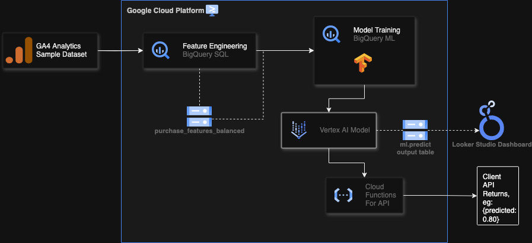

#### A project to create a ml model that predicts the probability that a visitor will purchase in their next session using bigquery, vertexai and looker studio. 

### Architecture

#### Setup instructions

to create the dataset in big-query use the following command in the terminal

`bq mk --dataset --location=US mvp_propensity`
